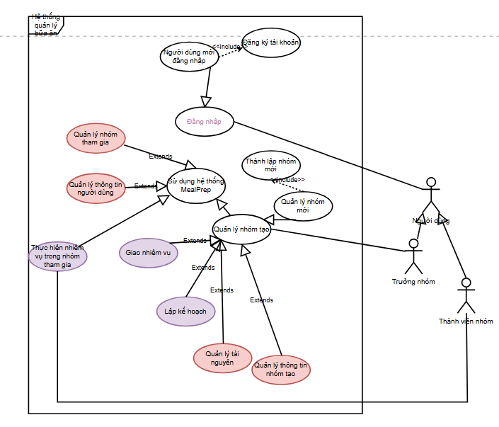
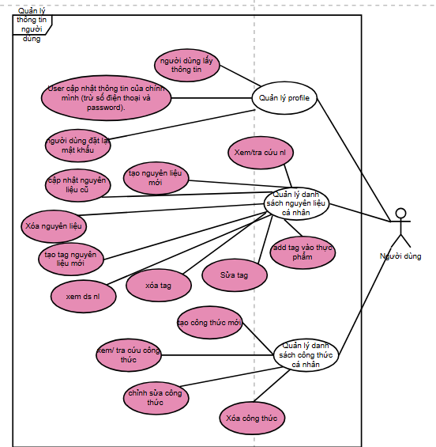
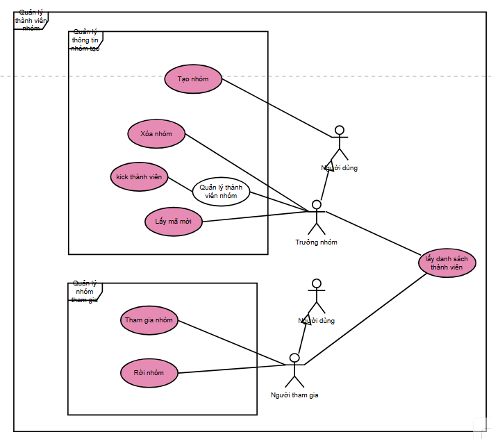
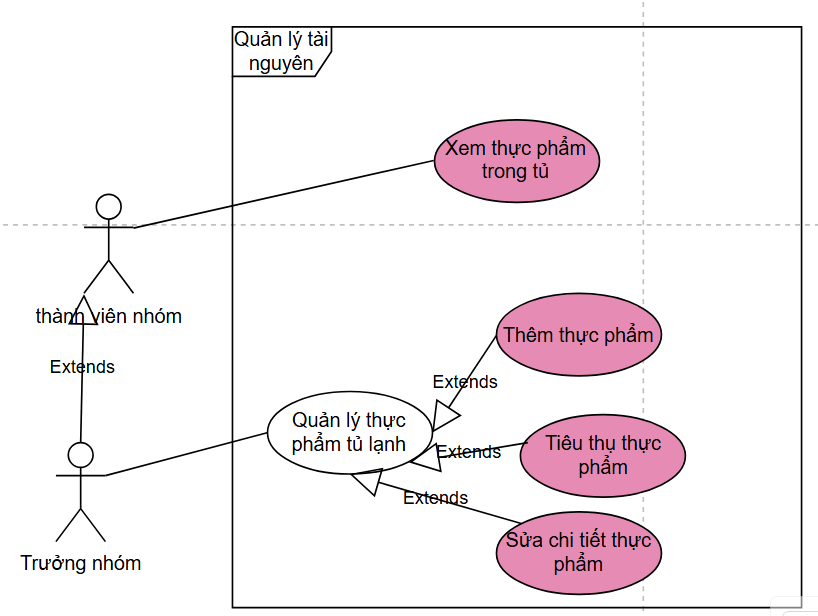
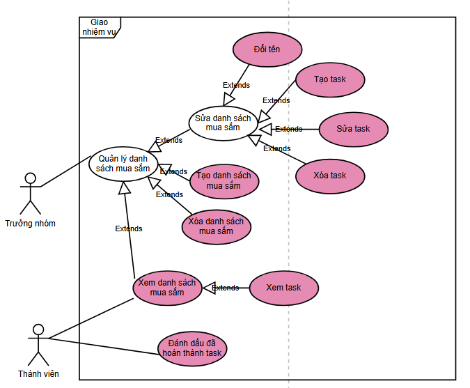
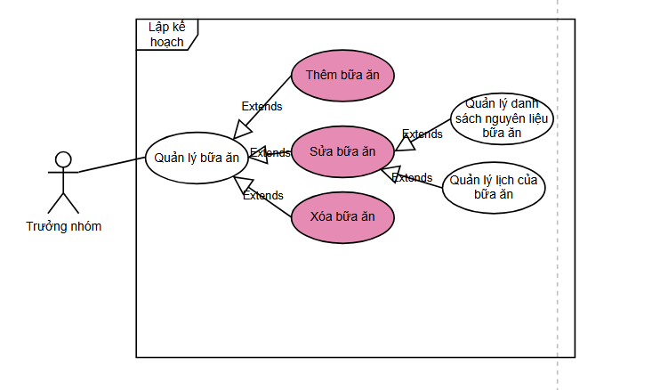

#IT-4788
### UseCase tổng quan


#IT-4788/quản_lý_thông_tin_người_dùng
### Usecase quản lý thông tin người dùng



| Method | URL                                 | Param type  | Param                                                                                                                                                                                                                                                                                                                       | Description                                                                             | ROLE | require      | status |
| ------ | ----------------------------------- | ----------- | --------------------------------------------------------------------------------------------------------------------------------------------------------------------------------------------------------------------------------------------------------------------------------------------------------------------------- | --------------------------------------------------------------------------------------- | ---- | ------------ | ------ |
| get    | /userInfo/profile/me                |             |                                                                                                                                                                                                                                                                                                                             | người dùng lấy thông tin                                                                |      | requireLogin |        |
| post   | /userInfo/profile/update_info/me    | body        | { name, các trường thông tin,… }                                                                                                                                                                                                                                                                                            | User cập nhật thông tin của chính mình (trừ số điện thoại và password).                 |      | requireLogin |        |
| post   | /userInfo/update_pass/me            | body        | { oldpass, newpass }                                                                                                                                                                                                                                                                                                        | người dùng đặt lại mật khẩu                                                             |      | requireLogin |        |
| get    | /userInfo/store/ingredients/me      |             |                                                                                                                                                                                                                                                                                                                             | lấy danh sách nguyên liệu cá nhân                                                       |      | requireLogin | done   |
| post   | /userInfo/store/ingredients         | body        | {"ingredient":{<br> "ingredient_name": "Mỳ ý",<br>    "unit_id": 2,<br>     "tags": [<br>                    {"tag_name": "Món ý"},<br>                    {"tag_name": "Món mì"}<br>                ]<br>            }<br>}                                                                                                | tạo nguyên liệu thông tin để trong body                                                 |      | requireLogin | done   |
| del    | /userInfo/store/ingredients         | param       | {<br>    "ingredient_name":"Cà rốt"<br>}                                                                                                                                                                                                                                                                                    | phải gửi nguyên liệu cũ trong body lên để tìm xóa                                       |      | requireLogin | done   |
| patch  | /userInfo/store/ingredients         | body        | {<br>    "old_ingredient_name":"Thịt gà",<br>    "new_ingredient":<br>        {<br>            "ingredient_name":"Thịt tê giác",<br>            "unit_id":2,<br>            "tags":[<br>                {"tag_name":"thịt"},<br>                {"tag_name":"siêu quý hiếm"}<br>                ]<br>        }<br>    <br>} | không có id nên phải gửi nguyên liệu cũ (tên) trong body để server tìm cập nhật         |      | requireLogin | done   |
| get    | /userInfo/store/ingredients/tag     |             |                                                                                                                                                                                                                                                                                                                             | lấy danh sách tag                                                                       |      | requireLogin | done   |
| post   | /userInfo/store/ingredients/tag     | body        | {<br>    "tag_name":"rau thơm"<br>}                                                                                                                                                                                                                                                                                         | tạo tag nguyên liệu mới                                                                 |      | requireLogin | done   |
| del    | /userInfo/store/ingredients/tag     | param       | {<br>    "tag_name":"thịt"<br>}                                                                                                                                                                                                                                                                                             | xóa tag, gửi tên tag cũ trong body                                                      |      | requireLogin | done   |
| put    | /userInfo/store/ingredients/tag     | body        | {<br>    "old_tag_name":"a",<br>    "new_tag_name":"Thịt"<br>}                                                                                                                                                                                                                                                              | sửa tag, gửi tên tag cũ trong body                                                      |      | requireLogin | done   |
| patch  | /userInfo/store/ingredients/add_tag | body        | {<br>    "tag_name":"thịt",<br>    "ingredient_name":"Cà rốt"<br>}                                                                                                                                                                                                                                                          | thêm 1 tag vào 1 nguyên liệu -> gửi tên nguyên liệu + tên tag (đòi hỏi tag phải có sẵn) |      | requireLogin | done   |
| post   | /userInfo/store/recipe              | body        | {recipeName, info...}                                                                                                                                                                                                                                                                                                       | tạo ct mới                                                                              |      | requireLogin |        |
| get    | /userInfo/store/recipe?keyword=     | query       |                                                                                                                                                                                                                                                                                                                             | xem, tra cứu công thức                                                                  |      | requireLogin |        |
| put    | /userInfo/store/recipe/:recipeId    | param, body | {updated info...}                                                                                                                                                                                                                                                                                                           | cập nhật ct cũ                                                                          |      | requireLogin |        |
| del    | /userInfo/store/recipe/:recipeId    | param       |                                                                                                                                                                                                                                                                                                                             | xóa ct cũ                                                                               |      | requireLogin |        |

#IT-4788/quản_lý_thành_viên_nhóm 
### UseCase quản lý thành viên nhóm


| Method | URL                                   | Param type | Param                         | Description                                                                            | ROLE | require                         |implementation status|
| ------ | ------------------------------------- | ---------- | ----------------------------- | -------------------------------------------------------------------------------------- | ---- | ------------------------------- |--|
| post   | /group                                | body       | {groupName}                   | tạo nhóm                                                                               |      | requireLogin                    |done|
| get    | /group/:GID/invite                |            |                               | lấy mã mời                                                                             |      | requireLogin, requireGroupAdmin |done|
| get    | /group/:GID/members               |            |                               | lấy danh sách thành viên nhóm                                                          |      | requireLogin, requireMember     |done|
| post  | /group/:GID/members/ban | body       | {memberId, reason}            | kick thành viên (cho vào blacklist/ remove khỏi danh sách thành viên?, mark là banned) |      | requireLogin ,requireGroupAdmin |done|
| POST   | /group/join/:group_code               | param      | groupcode                     | tham gia nhóm                                                                          |      | requireLogin                    |done |
| delete | /group/:GID/leave                 |            | get user id from cookie/token | rời nhóm                                                                               |      | requireLogin, requireMember     |done|
| delete  | /group/:GID/delete                | body       | {status}                      | admin đóng nhóm, chuyển status của nhóm thành 'deleted'                                |      | equireLogin, requireGroupAdmin  |done|

#### /group
req.param 
```text
http://localhost:9000/api/group
```
req.body
```json
{
    "group_name": "Hello world"
}
```
res:
```js
{
    "createdAt": "2024-12-01T15:25:42.742Z",
    "updatedAt": "2024-12-01T15:25:42.742Z",
    "GID": "e5f75852-31ae-4fc4-b43d-eda2bf53d8c0",
    "blacklist": [],
    "member_ids": [],
    "group_code": "jUzKGO1",
    "group_name": "Hello world",
    "manager_id": "ae83d2e2-ecee-4251-990d-696b00dea251"
}
```
#### /group/:GID/invite
req.param:
```param
http://localhost:9000/api/group/e5f75852-31ae-4fc4-b43d-eda2bf53d8c0/invite
```
res:
```json
{
    "group_code": "jUzKGO1"
}
```
#### /group/join/:group_code
req.param
```param
http://localhost:9000/api/group/join/E4F5G6H
```
res
khi người bị ban join group
```json
{
    "error": {
        "name": "ForbiddenError",
        "message": "You are banned from this group."
    }
}
```
khi thành viên join group
```json
{
    "error": {
        "name": "ForbiddenError",
        "message": "You are already a member of this group."
    }
}
```
ok
```json
{
    "message": "Joined group successfully"
}
```
#### /group/:GID/members
req.param
```text
http://localhost:9000/api/group/123e4567-e89b-12d3-a456-426614174000/members
```
res
```json
[
    {
        "UUID": "cdd7f5fe-00d6-4647-9115-030acbb7fd33",
        "email": "NgocMinh@gmail.com",
        "username": "NgocMinh"
    },
    {
        "UUID": "c7f3b1fc-6b5d-4bb9-aa8d-94f239f327cb",
        "email": "AnhKhoi@gmail.com",
        "username": "AnhKhoi"
    }
]
```
#### /group/:GID/leave
req
```param
http://localhost:9000/api/group/bfebd365-aed2-436f-9664-c6faa9c4820a/leave
```
res
```text
{
    "message": "Left group successfully"
}
```

#### /group/:GID/members/:memberId/ban
req:
```
http://localhost:9000/api/group/123e4567-e89b-12d3-a456-426614174000/members/ban

body:
{
    "UUID": "cdd7f5fe-00d6-4647-9115-030acbb7fd33"
}
```

res:
```
{
    "error": {
        "name": "ForbiddenError",
        "message": "User is already banned"
    }
}
```
```
{
    "message": "User banned successfully"
}
```
#### /group/:GID
req:
```
http://localhost:9000/api/group/123e4567-e89b-12d3-a456-426614174000
```
res:
```
{
    "message": "Group deleted successfully"
}
```

#IT-4788/quản_lý_tài_nguyên_nhóm
### UseCase quản lý tài nguyên nhóm



| Method | URL                        | Param type                                               | Param                                                                                                                                                                                                                                          | Description                                    | ROLE | require                         | status |
| ------ | -------------------------- | -------------------------------------------------------- | ---------------------------------------------------------------------------------------------------------------------------------------------------------------------------------------------------------------------------------------------- | ---------------------------------------------- | ---- | ------------------------------- | ------ |
| get    | /group/:GID/fridge         |                                                          |                                                                                                                                                                                                                                                | lấy danh sách đồ trong tủ lạnh                 |      | requireLogin, requireMember     | done   |
| post   | /group/:GID/fridge         | body                                                     | {<br>    "ingredient": {<br>    "ingredient_name": "Củ cải",<br>    "unit_id": 1,<br>    "detail": <br>      [{<br>        "quantity": 3,<br>        "createdAt": "2024-12-01"<br>      }]<br>  }<br>}                                         | thêm thực phẩm vào tủ lạnh                     |      | requireLogin, requireGroupAdmin | done   |
| patch  | /group/:GID/fridge         | param, body<br><br>gửi nguyên liệu đã được chỉnh sửa lên | {<br>    "old_ingredient_name":"Cà rốt",<br>    "ingredient":{<br>    "ingredient_name": "Củ cải",<br>    "unit_id": 1,<br>    "detail": <br>      [{<br>        "quantity": 3,<br>        "createdAt": "2024-12-01"<br>      }]<br>    }<br>} | chỉnh sửa thực phẩm trong tủ lạnh              |      | requireLogin, requireGroupAdmin | done   |
| delete | /group/:GID/fridge         | body                                                     | {<br>    "ingredient_name":"Cà rốt"<br>}                                                                                                                                                                                                       | xóa thực phẩm khỏi tủ lạnh                     |      | requireLogin, requireGroupAdmin | done   |
| patch  | /group/:GID/fridge/consume | body                                                     | {<br>    "ingredient_name":"Thịt gà",<br>    "quantity": 4<br>}                                                                                                                                                                                | tiêu thụ 1 lượng xác định thực phẩm từ tủ lạnh |      | requireLogin, requireGroupAdmin | done   |

#IT-4788/giao_nhiệm_vụ
### UseCase giao nhiệm vụ



| Method | URL                                                        | Param type | Param                                          | Description                                                                                                                             | ROLE | require                         |
| ------ | ---------------------------------------------------------- | ---------- | ---------------------------------------------- | --------------------------------------------------------------------------------------------------------------------------------------- | ---- | ------------------------------- |
| post   | /group/:groupId/shoppinglist                               | body       | {shoppinglistName}                             | add shopping list                                                                                                                       |      | requireLogin, requireGroupAdmin |
| get    | /group/:groupId/shoppinglist/:listId                       |            |                                                | xem shopping list                                                                                                                       |      | requireLogin, requireMember     |
| delete | /group/:groupId/shoppinglist/:listId                       |            |                                                | xóa shopping list                                                                                                                       |      | requireLogin, requireGroupAdmin |
| patch  | /group/:groupId/shoppinglist/:listId                       | body       | {shoppinglistNewName}                          | Sửa tên shopping list                                                                                                                   |      | requireLogin, requireGroupAdmin |
| post   | /group/:groupId/shoppinglist/:listId/tasks                 | body       | {ingredientName, quantity, Assignee, deadline} | tạo task mua sắm                                                                                                                        |      | requireLogin, requireGroupAdmin |
| get    | /group/:groupId/shoppinglist/:listId/tasks?status=         | query      |                                                | xem các task trong list (cho phép lọc theo status (đã hoàn thành/ chưa hoàn thành))                                                     |      | requireLogin, requireMember     |
| delete | /group/:groupId/shoppinglist/:listId/tasks                 | body       | {taskId}                                       | xóa task                                                                                                                                |      | requireLogin, requireGroupAdmin |
| patch  | /group/:groupId/shoppinglist/:listId/task/:taskId          | body       | {các trường thông tin của task cần thay đổi}   | chỉnh sửa task                                                                                                                          |      | requireLogin, requireGroupAdmin |
| patch  | /group/:groupId/shoppinglist/:listId/task/:taskId/complete |            |                                                | dựa vào token/cookie để lấy userid, so sánh với assignee của task, nếu trùng ok, endpoint này để chuyển status của task thành completed |      | requireLogin, requireMember     |

#IT-4788/lập_kế_hoạch
### UseCase lập kế hoạch


| Method | URL                           | Param type | Param                                                 | Description      | ROLE | require                         |
| ------ | ----------------------------- | ---------- | ----------------------------------------------------- | ---------------- | ---- | ------------------------------- |
| post   | /group/:groupId/meals         | body       | {danh sách nguyên liệu, ngày ăn dự kiến}              | tạo bữa ăn       |      | requireLogin, requireGroupAdmin |
| get    | /group/:groupId/meals         |            |                                                       | xem các bữa ăn   |      | requireLogin, requireMember     |
| patch  | /group/:groupId/meals/:mealId | body       | {danh sách nguyên liệu thay đổi, các thuộc tính khác} | chỉnh sửa bữa ăn |      | requireLogin, requireGroupAdmin |
| delete | /group/:groupId/meals/:mealId |            |                                                       | Xóa bữa ăn       |      | requireLogin, requireGroupAdmin |

#IT-4788/auth
### UseCase auth (done)

| Method | URL           | Param type | Param                             | Description                                         | ROLE | require      |
| ------ | ------------- | ---------- | --------------------------------- | --------------------------------------------------- | ---- | ------------ |
| post   | /auth/login   | body       | {phone, pass}                     | trả về jwt (encode thông tin user), lưu như cookie, |      |              |
| post   | /register     | body       | {các trường thông tin trong user} |                                                     |      |              |
| get    | /refreshToken |            |                                   | lấy về refresh token lưu vào local Storage          |      |              |
| post   | /auth/logout  |            |                                   |                                                     |      | requireLogin |

### UseCase admin (coming soon)